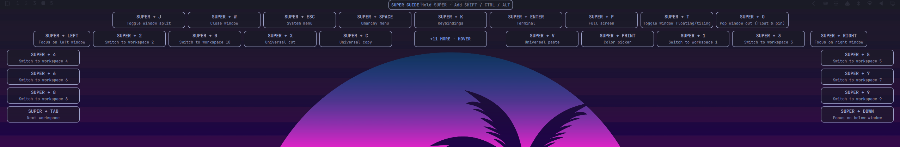
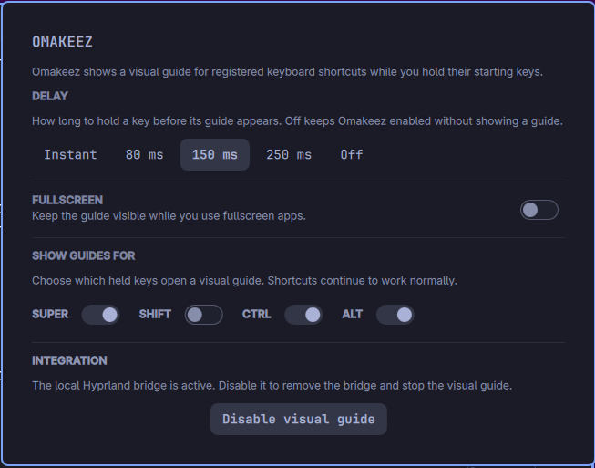
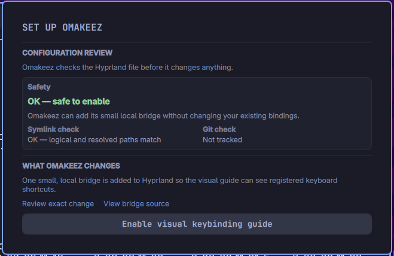

# Omakeez

Omakeez is a local-first visual guide for your registered Omarchy keyboard
shortcuts. Hold an enabled starting key to see the relevant shortcuts on the
focused monitor, without changing how the shortcuts themselves work.

## See it in use



*The guide arranges the highest-priority shortcuts near the center, preserves
the visible canopy while overflow expands on hover, and remains readable over
the active workspace.*

| Enabled controls | Safe first-time setup |
|---|---|
|  |  |
| Choose guide roots, delay, fullscreen behavior, or disable the guide. | Review the config target, safety checks, exact bridge source, and proposed change before enabling. |

## Requirements

Omakeez is tested with Omarchy 4.0.1, Quickshell 0.3.1, and Hyprland 0.56.2.
It is designed for Omarchy's Lua-based Hyprland configuration.

## Install

```sh
omarchy plugin add https://github.com/cyprusad/omakeez.git --enable
```

Open the Omakeez bar widget and select **Enable visual keybinding guide**.
Before anything changes, Omakeez shows the exact three-line bridge it proposes
to add to the resolved Hyprland configuration. The button is the only action
that writes configuration.

The controller preserves safe symlinks and user-owned Git-dotfiles targets. If
the target cannot be verified, Omakeez stays in setup mode and offers a manual
snippet instead; it never asks for root access or modifies an unsafe target.

## Using the guide

Hold `SUPER`, `SHIFT`, `CTRL`, or `ALT` to open a guide for shortcuts beginning
with that key. Add other modifier keys while holding it to narrow the visible
bindings. The guide follows the focused monitor.

The panel lets you:

- choose each guide root independently;
- choose how long a key must be held before the guide appears; and
- keep guides hidden over fullscreen apps by default, or enable them there.

Turning off a guide root hides only that overlay. It never disables the
underlying shortcut.

## Privacy and local files

Omakeez does not record or transmit what you type or do. It has no network
client, does not use `/dev/input`, and keeps no shortcut-use history.

It keeps only the local configuration metadata required to operate safely:

```text
${XDG_STATE_HOME:-$HOME/.local/state}/omarchy/omakeez/
├── catalog.json            # registered shortcut descriptions and opaque IDs
├── bridge-catalog.lua      # allowlist used by the in-memory Hyprland bridge
├── bridge-control.lock     # prevents concurrent configuration changes
└── backups/                # rollback copies created only when config changes
```

The catalog excludes dispatcher arguments. See the detailed
[security and privacy guide](docs/SECURITY.md), including an explanation of
the [auditable bridge](bridge.lua).

## Update or remove

```sh
omarchy plugin update io.github.cyprusad.omakeez --yes
```

To remove it cleanly, open the Omakeez panel, select **Disable visual guide**
to remove only its managed Hyprland bridge block, then run:

```sh
omarchy plugin disable io.github.cyprusad.omakeez
omarchy plugin remove io.github.cyprusad.omakeez
```

## Limitations

The guide identifies configured binding candidates from Hyprland's input event
and binding table. It does not claim to prove that a later dispatcher command
completed successfully. App-owned credential prompts such as 1Password are
outside Omarchy's lock/Polkit suppression boundary, but typed content is never
stored or emitted.

For recovery steps and every controller safety code, see
[Troubleshooting](docs/TROUBLESHOOTING.md).
